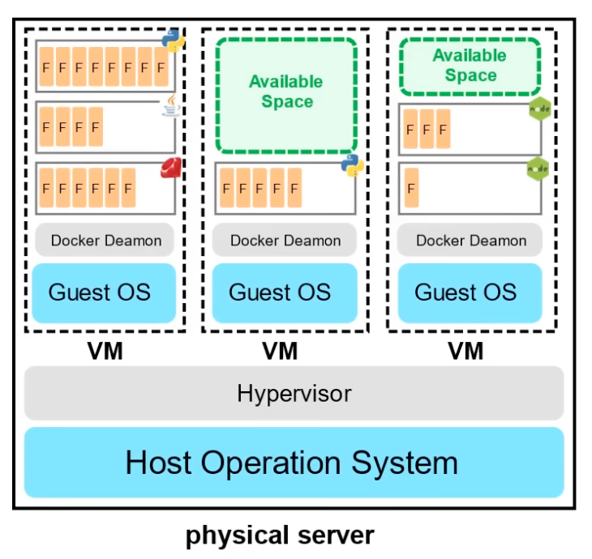

### Cloud Hosting Evolution

**Dedicated Server:** One physical machine, runs single web app/site.
*Expensive, high maintenance, high security*

**Virtual Private Server (VPS):** Once physical machine, multiple submachines thanks to virtualization.
*Better utilization and isolation of resources*

**Shared Hosting:** One physical machine, multiple users, multiple virtual machines.
*Cheap, limited functionality, poor isolation*

**Cloud Hosting:** Multiple physical machines that act as one platform. Abstracted into various cloud services.
*Flexible, Scalable, Secure, Cost Effective, High Configurability*

### Common Cloud Services

- Has hundreds of cloud services, grouped by functions. Most common types are:
  - Compute
  - Database
  - Networking
  - Storage

### Benefits of Cloud Computing
- **Cost Effective:** PAYG
- **Global:** Launch workloads anywhere in the world. Pick region.
- **Secure:** Physical lcaotion secured by CSP. Can configure at granular level.
- **Reliable:** Databackup, data replication and recovery. Fault tolerance.
- **Scalable:** Increase or decrease resources based on demand
- **Elastic:** Automate resource scaling during spikes and drop in demand.
- **Current:** Underlying hardware and managed software is patched and upgraded by cloud provider.

### Types of Cloud Computing

**SaaS:** Product run and managed by service provider.
**PaaS:** Focus on development and deployment of applications, not underlying infrastructure.
**IaaS:** Services that give access to provisioning of network, computers, data storage and database

### Cloud Computing Responsibilities

| On Premise     | IaaS               | PaaS               | SaaS               |
|----------------|--------------------|--------------------|--------------------|
| Application    | Application        | Application        | **Application**    |
| Data           | Data               | Data               | **Data**           |
| Runtime        | Runtime            | **Runtime**        | **Runtime**        |
| Middleware     | Middleware         | **Middleware**     | **Middleware**     |
| OS             | OS                 | **OS**             | **OS**             |
| Virtualization | **Virtualization** | **Virtualization** | **Virtualization** |
| Servers        | **Servers**        | **Servers**        | **Servers**        |
| Storage        | **Storage**        | **Storage**        | **Storage**        |
| Networking     | **Networking**     | **Networking**     | **Networking**     |

Bold = CSP resonsible

### Cloud Deployment Models

**Public:** Everything running within the cloud
**Private:** Everything built on company's datacenter. e.g. On Premise
**Hybrid:** Using on-Prem and Cloud. Service to connect the two deployment models.
**Cross-Cloud:** Uses multiple cloud providers e.g. Azure Arc - exten

### Total Cost of Ownership

**CapEx:** Spending money upfront on pyhysical infrastructure. e.g. Server, storage, routers, cables, switches, UPS.
**OpEx:** Concerned with non-phyiscal costs. E.g. software subscriptions, training employees, billing based on cloud metrics.

### Cloud Architecture Terminology

**Solutions Architect:** Creates technical solutions using multiple systems via research, documentation and experimentation. Those focused on cloud technologies are refered to ***Cloud Architects***.

## Cloud Concepts

**High Availability:** Ability to keep service available to consumers by ensuring there is no single point of failure.
 - Run workloads across multiple availability zones
 - Distribute traffic across all workloads using a *load balancer*.

**Scalability:** Ability to increase capacity based on increase in demand.
 - Scale Up: Upgrade to bigger server
 - Scale Out: Provision multiple instances of the same server to distribute workloads.

**Elasticity:** Auto increase/decrease capacity based on demand.
 - Horizontal Scaling: Out = increase, In = decrease
 - Azure VM Scale Set

**Fault Tolerance:** Ensure there is no single point of failure.. preventing chance of failure.
 - Failover: Shift traffic to a redundant system when primary system fails.
 - Azure Traffic Manager: DNS based traffic balancer.

**Durability:** Recover from disaster and prevent loss of data.

### Business Continuity Plan

Document how business will operate during an unplanned disruption.

**Recovery Point Objective:** Maximum acceptable amount of data loss after incident, expressed as amount in time.
 - How much data are you willing to lose
**Recovery Time Objective:** Maximum amount of downtime business can tolerate without incurring significant financial loss.
 - How much time are you willing to spend down?

### Disaster Recovery Options

Options range from Cold (Lower cost, longer to recover) to Hot (High Cost, Quick to recover)

**Backup and Restore:** Backup data and restore to new infrastructure. Hours
**Pilot Light:** Data replicated to new region. Skeleton services running. 10 min
**Warm Standby:** Scaled down copy of infrastructure running ready to scale up. minutes
**Multi-site/Active/active:** Scaled up copy of infrastructure running in different region. Realtime.

## Evolution of Compute

**Dedicated Servers**
- Phyiscal server wholly utilized by single customer.
- Have to guess capacity
- Upgrading is slow and expensive
- Limited by OS
- Mutiple apps can results in conflicts in resource sharing.
- Gaurantee of security, privacy and full utility

**Virtual Machines**
- Run multiple VMs on one machine.
- Hypervisor is software layer that makes running VMs possible.
- Physical server shared with multiple customers
- Paying fraction of server
- Overpay for underutilized machine
- Limited by Guest OS
- Mutiple apps on single VM -> resource sharing issues

**Containers**
- Virtual machine running on multiple containers
- Daemon is software layer (like hypervisor)
- Maximise utility of avialable space -> more cost effective
- Containers share underlying OS so more efficient
- Multiple apps can run side by side without being limited to OS requirements -> no resource sharing conflicts

**Functions**

- Managed VM running in managed containers
- Serverless Compute
- Upload piece of code -> choose memory and duration
- Only responsible for code and data
- Very cost effective -> PAYG structure
- Side Effect: Cold Start -> wait time before function can run

### Regions

**Region:** Grouping of multiple data centers into AZ
**Geography:** Discreet market of two or more regions that preserve *data residency* and *compliance boundaries*.

### Paired Regions

- Each region paired with another 300 miles away. Only one region updated to ensure no outages.
- Some services rely on paired regions
  - Azure geo-redundant Storage: replicates to secondary region

### Region Types and Service Availability

- Not all services available in every region.
- **Recommended Region:** Provides broadest range of service capabilities. Designed to support AZs.
- **Alternate Region:** Extends Azure footprint within a data residency where recommended region also exists. Not designed to support AZ.

**General Availability:** Service is ready to be used publicly by everyone.
Grouped into three categories:
 - Foundational: When GA, available immediately or in 12 months in recommended/alternate regions.
 - Mainstream: When GA, available immediately or in 12 months in Recommended Region. Available in alternate region based on customer demand.
 - Specialized: Available in recommended and ALternate based on customer demand

### Special Regions

Specialized regions to meet compliance/legal reasons

## Global Infrastructure

### Availability Zones

Phyiscal location of one or more data center
- Data center: secured building that contains hundreds of thousands of computers.
- Region generally contains 3 AZs
- Data centes within region will be isolated from each other. Close enough for low latency.
- Common to run workloads on at least 3 AZs

**AZ supported regions**: Recommended Regions usually have 3 AZs.
Alternate or Other regions do not have support for Availability Zones.

**Fault and Update Domains:** AZ combination of *fault domain* and an *update domain*.
 - Fault Domain: Grouping of VMs that share common power source and network switch.
 - Update Domain: Groups of VMs and underlying physical hardware that can be rebooted at the same time.
 - Availability Set: VM Grouping in Azure to ensure VMs are in different Fault and Update domains.

https://www.youtube.com/watch?v=5abffC-K40c&t=4406s / 1:24:09